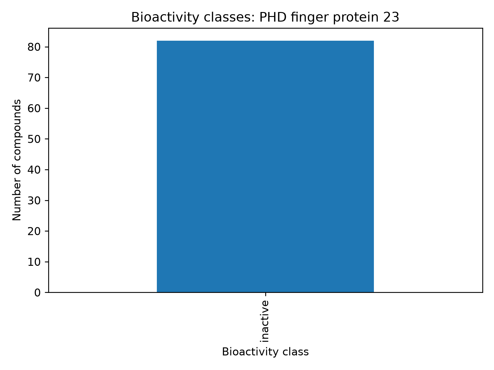
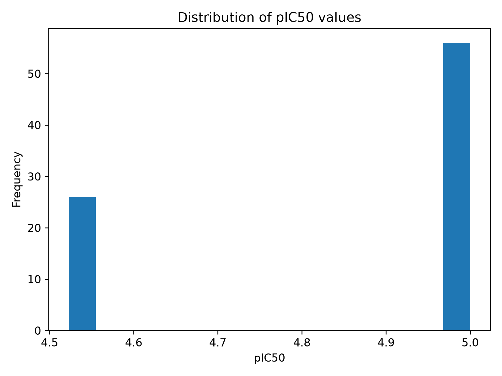

# Drug Discovery Pipeline

A reproducible computational drug-discovery workflow built around ChEMBL bioactivity data.

The purpose of this repository is to demonstrate a complete **bioactivity data analysis pipeline**: retrieving target-specific activity data, preprocessing the measurements, calculating molecular descriptors, generating exploratory plots, assessing whether the dataset is suitable for machine learning, and reporting the conclusions transparently.

## Project objective

This repository focuses on the **workflow**, not on forcing a successful drug-discovery result.

The worked example uses **PHD finger protein 23 (PHF23)**, ChEMBL target **CHEMBL2424508**. The available IC50 data for this example do not provide enough activity variation for meaningful predictive modeling. That outcome is deliberately preserved because it demonstrates an important part of real scientific analysis:

> A valid pipeline should be able to conclude that a dataset is not suitable for modeling instead of forcing a model or overstating the biological result.

## Pipeline

The project performs the following steps:

1. Search and identify the protein target in ChEMBL.
2. Retrieve target-specific **IC50** bioactivity records.
3. Remove missing, invalid, and duplicate observations.
4. Assign compounds to activity classes.
5. Convert IC50 values to **pIC50**.
6. Calculate Lipinski-style molecular descriptors using RDKit.
7. Generate exploratory plots and descriptive statistics.
8. Assess whether the dataset contains enough observations and response variation for predictive modeling.
9. Fit a Random Forest regression model only when the data satisfy basic modeling requirements.
10. Generate a data-driven conclusions report.

## Example target: PHF23

The current analysis uses:

- **Target:** PHD finger protein 23 (PHF23)
- **ChEMBL target ID:** `CHEMBL2424508`
- **Activity measurement:** IC50

After preprocessing, the dataset contains **82 IC50 observations**.

| Bioactivity class | Definition | Count |
|---|---|---:|
| Active | IC50 <= 1,000 nM | 0 |
| Intermediate | 1,000 < IC50 < 10,000 nM | 0 |
| Inactive | IC50 >= 10,000 nM | 82 |

All 82 processed observations are therefore classified as inactive.

The observed pIC50 values range from **4.52 to 5.00**, with a median of **5.00**.

Because the dataset contains only one activity class and only two unique pIC50 values, the pipeline correctly **skips predictive regression** instead of forcing a statistically weak model.

## Important interpretation

The result above does **not** prove that PHF23 is inherently "not druggable", that PHF23 cannot be therapeutically targeted, or that no active compound against PHF23 can exist.

It means only that the **specific ChEMBL IC50 records retrieved and processed in this example** are uniformly inactive and provide insufficient response variation for a defensible machine-learning model.

Different assay types, experimental conditions, compound libraries, future ChEMBL releases, or independent experimental studies could produce different results.

The PHF23 example is therefore included primarily to demonstrate the **pipeline and scientific decision process**, even though this particular dataset does not support progression to predictive drug-discovery modeling.

## Generated outputs

Running `analysis_pipeline.py` creates:

- `outputs/phf23_bioactivity_raw.csv` — raw ChEMBL records
- `outputs/phf23_bioactivity_processed.csv` — cleaned dataset with pIC50 and molecular descriptors
- `outputs/activity_class_counts.csv` — activity-class counts
- `outputs/numeric_summary.csv` — numerical summary statistics
- `outputs/CONCLUSIONS.md` — automatically generated interpretation
- `outputs/plots/` — exploratory figures

## Plots

The pipeline generates:

- Bioactivity class distribution
- pIC50 distribution
- Molecular weight vs pIC50
- LogP vs pIC50
- Molecular-descriptor correlation matrix

### Bioactivity class distribution



### pIC50 distribution



## Repository structure

```text
Drug_Discovery_Pipeline/
├── Bioactivity Data Extraction(PHD_finger_protein 23).ipynb
├── PHF23_Bioactivity_Analysis_Results.ipynb
├── analysis_pipeline.py
├── requirements.txt
├── README.md
├── .gitignore
└── outputs/
    ├── CONCLUSIONS.md
    ├── activity_class_counts.csv
    ├── numeric_summary.csv
    ├── phf23_bioactivity_processed.csv
    ├── phf23_bioactivity_raw.csv
    └── plots/
        ├── 01_bioactivity_class_distribution.png
        ├── 02_pIC50_distribution.png
        ├── 03_MW_vs_pIC50.png
        ├── 04_LogP_vs_pIC50.png
        └── 05_descriptor_correlation_matrix.png
```

## Installation

Clone the repository:

```bash
git clone https://github.com/Bio-Petrisis/Drug_Discovery_Pipeline.git
cd Drug_Discovery_Pipeline
```

Create a virtual environment:

```bash
python -m venv .venv
```

On Windows Command Prompt:

```cmd
.venv\Scripts\activate.bat
```

Install the required packages:

```bash
python -m pip install --upgrade pip
pip install -r requirements.txt
```

## Run the analysis

Run:

```bash
python analysis_pipeline.py
```

The generated results will be written to the `outputs/` directory.

For an interactive presentation of the results, open:

```text
PHF23_Bioactivity_Analysis_Results.ipynb
```

and run the notebook using the same Python environment.

## Main dependencies

- Python
- pandas
- NumPy
- ChEMBL Web Resource Client
- RDKit
- Matplotlib
- scikit-learn
- Jupyter / VS Code notebook support

## Disclaimers

### Educational and portfolio use

This project is intended for **educational, research-training, and portfolio purposes**. It demonstrates a computational workflow and should not be interpreted as a validated drug-development study.

### Not medical advice

Nothing in this repository should be used for diagnosis, treatment, clinical decision-making, or patient care.

### Not proof of target druggability or non-druggability

The lack of active compounds in this particular PHF23 dataset does **not** establish that PHF23 is biologically or clinically undruggable. It only describes the measurements available in the analyzed ChEMBL data slice.

### Dataset-dependent results

All conclusions depend on the records retrieved from ChEMBL, the filtering criteria, the activity thresholds, and the specific assay measurements used. ChEMBL is continuously updated, so future analyses may retrieve different records.

### Assay heterogeneity

Bioactivity measurements may originate from different assays and experimental conditions. Such measurements should not automatically be treated as perfectly equivalent.

### Activity thresholds are analytical conventions

The active/intermediate/inactive thresholds used here are practical thresholds for this demonstration and are not universal biological rules.

### Machine-learning limitations

A machine-learning model should not be trained simply because code is available to do so. Data quantity, balance, chemical diversity, assay consistency, measurement quality, and target-variable variation must be evaluated first.

In this example, the PHF23 dataset fails the response-variation requirement, so the pipeline intentionally does not force a predictive model.

### No fabricated balancing

No observations are invented, relabeled, or artificially modified to create active compounds or improve class balance.

### Experimental validation is required

Any computational prediction, target hypothesis, or candidate compound would require independent experimental validation and expert review before it could be considered biologically or clinically actionable.

## Main takeaway

The key outcome of this project is methodological:

**data retrieval -> preprocessing -> descriptor calculation -> exploratory analysis -> data-quality assessment -> modeling decision -> conclusions**

For this PHF23 example, the scientifically appropriate modeling decision is to stop before fitting an unjustified predictive model.

For a different target with a larger, more diverse, and better-balanced bioactivity dataset, the same pipeline can continue into predictive modeling.

## Acknowledgment

This project was inspired by computational drug-discovery and bioinformatics workflows popularized by **Data Professor (Chanin Nantasenamat)** and was adapted into a reproducible, target-specific PHF23 analysis workflow.
